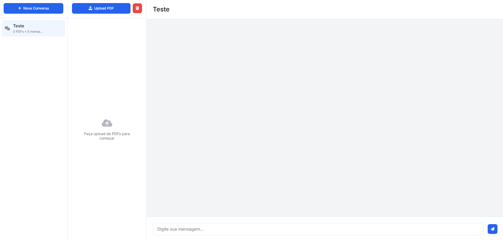

# ChatPDF - Assistente de Conversação com PDFs

O ChatPDF é uma aplicação web moderna que permite aos usuários fazer upload de documentos PDF e interagir com eles através de uma interface de chat intuitiva. Utilizando a tecnologia GPT da OpenAI e processamento avançado de linguagem natural, o sistema permite que você faça perguntas sobre o conteúdo dos seus documentos e receba respostas contextualizadas.

## 🚀 Funcionalidades

- 💬 Interface de chat interativa
- 📁 Upload múltiplo de arquivos PDF
- 🔍 Processamento e análise de texto em PDFs
- 💾 Sistema de sessões para gerenciar diferentes conversas
- 🔄 Histórico completo de mensagens
- 📱 Interface responsiva e amigável

## 🛠️ Tecnologias Utilizadas

### Backend
- **FastAPI**: Framework web moderno e rápido para construção de APIs
- **LangChain**: Framework para desenvolvimento de aplicações com LLMs
- **OpenAI**: Integração com modelos de linguagem avançados
- **FAISS**: Biblioteca para busca eficiente de similaridade
- **PyPDF2**: Processamento de arquivos PDF
- **Uvicorn**: Servidor ASGI de alto desempenho

### Frontend
- **HTML5**: Estruturação moderna do conteúdo
- **CSS Grid**: Layout responsivo e flexível
- **Bootstrap 3.3**: Framework CSS para componentes visuais
- **JavaScript**: Interatividade e comunicação com o backend

## 📁 Estrutura do Projeto

```
ChatPDF/
├── server.py           # Servidor FastAPI principal
├── chat.html          # Interface principal do chat
├── chat.css           # Estilos da interface
├── requirements.txt   # Dependências Python
├── .env              # Configurações de ambiente
├── static/           # Arquivos estáticos
├── images/           # Imagens e recursos visuais
└── bootstrap3.3/     # Arquivos do Bootstrap
```

## 🔧 Configuração e Instalação

1. Clone o repositório
2. Instale as dependências:
   ```bash
   pip install -r requirements.txt
   ```
3. Configure o arquivo `.env` com sua chave da API OpenAI:
   ```
   OPENAI_API_KEY=sua-chave-aqui
   ```
4. Execute o servidor:
   ```bash
   python server.py
   ```

## 🖥️ Preview da Interface



## 🔑 Recursos Principais

### Gerenciamento de Sessões
- Criação de múltiplas sessões de chat
- Personalização de títulos das sessões
- Sistema de histórico por sessão

### Processamento de PDFs
- Upload de múltiplos arquivos
- Extração e processamento de texto
- Vetorização de conteúdo para busca eficiente

### Chat Interativo
- Respostas contextualizadas baseadas no conteúdo dos PDFs
- Histórico completo de conversas
- Interface amigável e responsiva

## 🤝 Contribuição
Contribuições são bem-vindas! Sinta-se à vontade para abrir issues e pull requests.

## 📄 Licença
Este projeto está sob a licença MIT. Veja o arquivo [LICENSE](LICENSE) para mais detalhes.

## 👨‍💻 Autor
[Jan Pereira](https://github.com/janpereira82)
